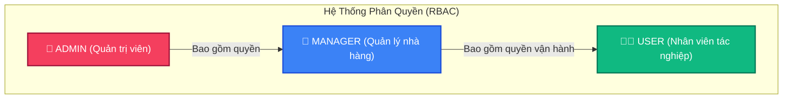
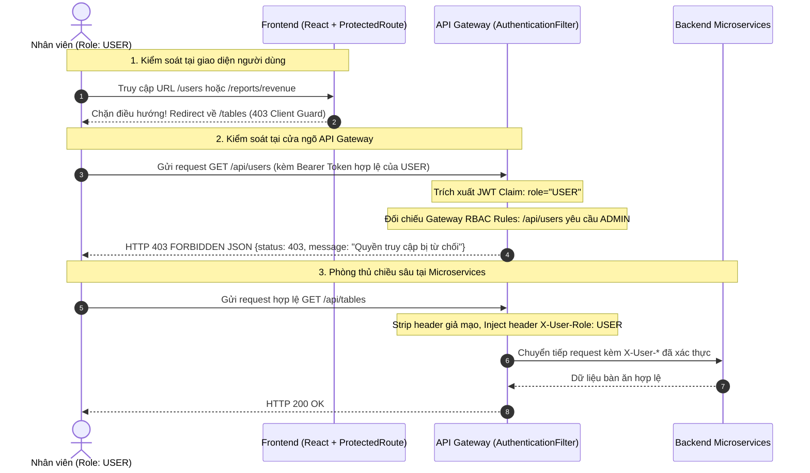

# 🛡️ MA TRẬN PHÂN QUYỀN HỆ THỐNG (ROLE-BASED ACCESS CONTROL - RBAC MATRIX)

> **Dự án:** Hệ Thống Quản Lý Nhà Hàng Kiến Trúc Microservices (Restaurant Microservices)  
> **Tài liệu tham chiếu:** Phân quyền đa lớp (Multi-layer RBAC) cho cả Frontend (React SPA) và Backend (Spring Cloud Microservices).  
> **Phiên bản:** 1.0.0 — Cập nhật ngày: 06/10/2026

---

## 📌 1. TỔNG QUAN VÀ ĐỊNH NGHĨA VAI TRÒ (ROLES)

Hệ thống được thiết kế với cơ chế phân quyền dựa trên vai trò (**Role-Based Access Control - RBAC**) với 3 vai trò người dùng chuẩn hóa trong toàn bộ vòng đời ứng dụng:



### 1.1. `ADMIN` — Quản trị viên hệ thống (Super Administrator)
- **Mục tiêu:** Quản trị toàn bộ hạ tầng phần mềm, nhân sự và kiểm soát tài chính cấp cao.
- **Phạm vi quyền hạn:**
  - Toàn quyền truy cập và thao tác tất cả các chức năng trong hệ thống (Super Admin).
  - Độc quyền quản trị danh sách người dùng (`/users`): Thêm nhân viên mới, phân quyền vai trò, mở/khóa tài khoản, xem danh sách toàn bộ nhân sự.
  - Toàn quyền xem và xuất các báo cáo tài chính, doanh thu, lợi nhuận (`/reports/revenue`, `/dashboard`).
  - Toàn quyền thiết lập và cấu hình bàn ăn, thực đơn, định lượng công thức món ăn (BOM), danh mục nguyên liệu, kho bãi.
  - Toàn quyền hủy đơn hàng, xóa dữ liệu bàn, nguyên liệu khi cần thiết.

### 1.2. `MANAGER` — Quản lý vận hành nhà hàng (Restaurant Operations Manager)
- **Mục tiêu:** Điều hành hoạt động kinh doanh thường nhật, kiểm soát chi phí, định lượng chế biến và phân tích số liệu tài chính.
- **Phạm vi quyền hạn:**
  - Quản lý thực đơn và định lượng công thức nấu ăn (`/menu`, `/recipes`): Tạo món, chỉnh sửa giá bán, lập công thức trừ kho tự động.
  - Quản lý kho nguyên vật liệu (`/ingredients`, `/inventory/receipts`, `/inventory/issues`): Nhập hàng, xuất hủy nguyên liệu hỏng, điều chỉnh kiểm kê kho.
  - Quản lý sổ chi phí vận hành (`/expenses`): Nhập tiền mặt bằng, điện nước, phụ phí nhà hàng.
  - Theo dõi Dashboard và báo cáo doanh thu kinh doanh (`/dashboard`, `/reports/revenue`).
  - Thêm, sửa, sắp xếp sơ đồ bàn ăn (`/tables`).
  - Thẩm quyền phê duyệt hủy đơn hàng của khách (`DELETE /api/orders/{id}`).
  - **Giới hạn nghiêm ngặt:** **KHÔNG ĐƯỢC PHÉP** truy cập danh sách nhân sự hay tạo/sửa/xóa tài khoản người dùng (`/users`).

### 1.3. `USER` — Nhân viên tác nghiệp (Operations Staff: Phục vụ, Thu ngân, Bếp KDS)
- **Mục tiêu:** Thực thi các tác vụ bán hàng, phục vụ khách, chế biến món và bàn giao ca làm việc hàng ngày.
- **Phạm vi quyền hạn:**
  - **Bán hàng & POS (`/orders/create`):** Mở đơn hàng tại bàn, chọn món, ghi chú yêu cầu của khách, gửi đơn sang bếp.
  - **Sổ đơn hàng & Hóa đơn (`/orders`, `/orders/:id/invoice`):** Xem danh sách đơn đang phục vụ, in phiếu hóa đơn thanh toán cho khách.
  - **Màn hình Bếp KDS (`/kitchen`):** Xem danh sách các món cần chế biến theo thời gian thực; cập nhật trạng thái món: `PENDING` -> `PREPARING` -> `READY`.
  - **Sơ đồ bàn & Đặt bàn (`/tables`, `/reservations`):** Xem tình trạng bàn (trống/có khách/chờ dọn), chuyển trạng thái bàn, tiếp nhận lịch đặt bàn trước.
  - **Quản lý ca làm việc cá nhân (`/shifts`):** Mở ca đầu ngày, kiểm đếm tiền mặt, bàn giao tiền và chốt ca cuối ngày.
  - **Hỗ trợ khách quét mã QR (`/qr`):** Xem và tải mã QR định danh của từng bàn để khách quét gọi món trên điện thoại (`/public/order`).
  - **Báo cáo tồn kho (`/reports/stock`):** Theo dõi số lượng nguyên liệu khả dụng và cảnh báo mức tồn dưới ngưỡng tối thiểu.
  - **Giới hạn nghiêm ngặt:**
    - ❌ **KHÔNG ĐƯỢC** xem báo cáo doanh thu tài chính (`/reports/revenue`) hoặc màn hình Dashboard doanh thu (`/dashboard`).
    - ❌ **KHÔNG ĐƯỢC** xem và thêm chi phí vận hành (`/expenses`).
    - ❌ **KHÔNG ĐƯỢC** thêm/sửa/xóa món ăn, nguyên liệu, phiếu nhập xuất kho.
    - ❌ **KHÔNG ĐƯỢC** thêm hoặc xóa bàn ăn trong sơ đồ nhà hàng.
    - ❌ **KHÔNG ĐƯỢC** tự ý hủy đơn hàng đã xác nhận (phải gọi Quản lý hoặc Admin).
    - ❌ **KHÔNG ĐƯỢC** truy cập module Quản trị nhân sự (`/users`).

---

## 🏗️ 2. KIẾN TRÚC BẢO MẬT & PHÂN QUYỀN ĐA LỚP (DEFENSE-IN-DEPTH)

Hệ thống thiết lập cơ chế kiểm soát truy cập đa lớp để đảm bảo an toàn tối đa:



### 2.1. Tầng 1: Frontend Route Guards & Dynamic Rendering
- **Tập tin:** [`frontend/src/components/layout/protected-route.tsx`](file:///d:/Work/Study/HDV/restaurant-microservices/frontend/src/components/layout/protected-route.tsx), [`frontend/src/App.tsx`](file:///d:/Work/Study/HDV/restaurant-microservices/frontend/src/App.tsx)
- **Cơ chế:**
  - Khi người dùng truy cập trực tiếp đường dẫn bị hạn chế (ví dụ nhập tay `/users` trên thanh địa chỉ trình duyệt), `ProtectedRoute` kiểm tra `user.role` từ Zustand Store. Nếu không nằm trong `allowedRoles`, tự động điều hướng:
    - Nếu là `USER`: Điều hướng về `/tables`.
    - Nếu là `MANAGER` hoặc `ADMIN`: Điều hướng về `/dashboard`.
- **Dynamic Navigation:** [`frontend/src/components/layout/app-sidebar.tsx`](file:///d:/Work/Study/HDV/restaurant-microservices/frontend/src/components/layout/app-sidebar.tsx) lọc bỏ hoàn toàn các mục menu mà tài khoản không có quyền xem, mang lại trải nghiệm gọn gàng, bảo mật.
- **Component-Level Authorization:**
  - Nút **"Thêm bàn"**, **"Xóa bàn"** tại trang sơ đồ bàn bị ẩn đối với vai trò `USER`.
  - Nút **"Hủy đơn hàng"** tại trang sổ đơn hàng bị ẩn đối với vai trò `USER`.

### 2.2. Tầng 2: API Gateway Centralized RBAC Gatekeeper
- **Tập tin:** [`backend/api-gateway/src/main/java/com/restaurant/gateway/filter/AuthenticationFilter.java`](file:///d:/Work/Study/HDV/restaurant-microservices/backend/api-gateway/src/main/java/com/restaurant/gateway/filter/AuthenticationFilter.java)
- **Cơ chế:**
  - API Gateway đóng vai trò là "chốt chặn duy nhất" (Gatekeeper) đối với mọi truy cập mạng từ bên ngoài.
  - Phân tích chữ ký số HMAC-SHA256 của JWT Access Token.
  - Trích xuất claim `role` mật mã học từ payload.
  - Áp dụng ma trận chính sách RBAC (xem Bảng 4.2). Nếu vi phạm, trả về ngay lập tức HTTP `403 Forbidden` dạng JSON chuẩn hóa, **không bao giờ forward request đến các microservice phía sau**, giúp triệt tiêu hoàn toàn nguy cơ tấn công IDOR hoặc khai thác API ngầm.
  - **Chống làm giả danh tính (Header Spoofing Prevention):** Gateway chủ động xóa bỏ (`remove`) tất cả các header `X-User-Id`, `X-User-Username`, `X-User-Role`, `X-User-Fullname` do client gửi lên, sau đó gắn lại các giá trị được giải mã từ JWT token hợp lệ trước khi chuyển tiếp cho downstream service.

### 2.3. Tầng 3: Downstream Microservices Defense-in-Depth
- **Tập tin:** [`backend/user-service/src/main/java/com/restaurant/user/controller/UserController.java`](file:///d:/Work/Study/HDV/restaurant-microservices/backend/user-service/src/main/java/com/restaurant/user/controller/UserController.java)
- **Cơ chế:**
  - Microservice đọc header `X-User-Role` và `X-User-Id` đáng tin cậy đã được Gateway xác thực.
  - Kiểm tra bổ sung: Ngay cả khi request lọt qua mạng nội bộ, `UserController` vẫn kiểm tra:
    - `createUser`, `updateUser`, `deleteUser`: Yêu cầu `X-User-Role == 'ADMIN'`.
    - `getUserById`: Nếu không phải `ADMIN`, chỉ cho phép đọc thông tin của chính mình (`id == currentUserId`).

---

## 📊 3. MA TRẬN PHÂN QUYỀN GIAO DIỆN FRONTEND (FRONTEND ROUTE MATRIX)

| STT | Tên Trang / Chức Năng | Đường Dẫn (Route) | Phân Loại | `ADMIN` | `MANAGER` | `USER` (Staff) | Hành Vi Khi Không Có Quyền |
|:---:|-----------------------|-------------------|-----------|:-------:|:---------:|:--------------:|----------------------------|
| 1 | **Đăng nhập** | `/login` | Công khai | ✅ | ✅ | ✅ | Hiển thị form đăng nhập |
| 2 | **Đăng ký** | `/register` | Công khai | ✅ | ✅ | ✅ | Hiển thị form đăng ký |
| 3 | **Khách tự gọi món QR** | `/public/order` | Công khai | ✅ | ✅ | ✅ | Khách hàng quét QR truy cập |
| 4 | **Trang chủ (Redirect)** | `/` | Điều hướng | ✅ -> `/dashboard` | ✅ -> `/dashboard` | ✅ -> `/tables` | Điều hướng thông minh theo vai trò |
| 5 | **Sơ đồ bàn & Đặt bàn** | `/tables` | Vận hành | ✅ | ✅ | ✅ | Hiển thị sơ đồ bàn (Ẩn nút Thêm/Xóa với USER) |
| 6 | **Danh sách đặt bàn** | `/reservations` | Vận hành | ✅ | ✅ | ✅ | Xem, tiếp nhận lịch đặt bàn |
| 7 | **Sổ đơn hàng** | `/orders` | Vận hành | ✅ | ✅ | ✅ | Xem danh sách (Ẩn nút Hủy đơn với USER) |
| 8 | **Bán hàng (POS Mở đơn)**| `/orders/create` | Vận hành | ✅ | ✅ | ✅ | Thao tác mở đơn, chọn món |
| 9 | **Chi tiết & In hóa đơn**| `/orders/:id/invoice` | Vận hành | ✅ | ✅ | ✅ | Xem và in phiếu thanh toán |
| 10 | **Màn hình Bếp (KDS)** | `/kitchen` | Vận hành | ✅ | ✅ | ✅ | Xem và đổi trạng thái chế biến |
| 11 | **Quản lý ca làm việc**| `/shifts` | Vận hành | ✅ | ✅ | ✅ | Mở ca, chốt ca, đếm tiền mặt |
| 12 | **Quản lý mã QR bàn** | `/qr` | Vận hành | ✅ | ✅ | ✅ | Xem, tải mã QR định danh bàn |
| 13 | **Báo cáo tồn kho** | `/reports/stock` | Vận hành | ✅ | ✅ | ✅ | Theo dõi tồn kho & cảnh báo thiếu hàng |
| 14 | **Dashboard Thống kê** | `/dashboard` | Quản trị | ✅ | ✅ | ❌ | Chặn truy cập; Redirect về `/tables` |
| 15 | **Thực đơn nhà hàng** | `/menu` | Quản trị | ✅ | ✅ | ❌ | Chặn truy cập; Redirect về `/tables` |
| 16 | **Công thức định lượng**| `/recipes` | Quản trị | ✅ | ✅ | ❌ | Chặn truy cập; Redirect về `/tables` |
| 17 | **Nguyên liệu kho** | `/ingredients` | Quản trị | ✅ | ✅ | ❌ | Chặn truy cập; Redirect về `/tables` |
| 18 | **Phiếu nhập kho** | `/inventory/receipts` | Quản trị | ✅ | ✅ | ❌ | Chặn truy cập; Redirect về `/tables` |
| 19 | **Phiếu xuất kho** | `/inventory/issues` | Quản trị | ✅ | ✅ | ❌ | Chặn truy cập; Redirect về `/tables` |
| 20 | **Sổ chi phí vận hành**| `/expenses` | Quản trị | ✅ | ✅ | ❌ | Chặn truy cập; Redirect về `/tables` |
| 21 | **Báo cáo doanh thu** | `/reports/revenue` | Quản trị | ✅ | ✅ | ❌ | Chặn truy cập; Redirect về `/tables` |
| 22 | **Quản trị nhân sự** | `/users` | Hệ thống | ✅ | ❌ | ❌ | Chặn truy cập; Redirect về `/dashboard` hoặc `/tables` |

---

## 🔌 4. MA TRẬN PHÂN QUYỀN API BACKEND (BACKEND REST API MATRIX)

### 4.1. Bảng Chi Tiết Theo Microservice & Endpoint

| Microservice | Phương Thức | Endpoint API | Quyền Hạn Cho Phép | Mục Đích Nghiệp Vụ | Xử Lý Khi Vi Phạm |
|--------------|:-----------:|--------------|:------------------:|--------------------|:-----------------:|
| **auth-service** | `POST` | `/api/auth/login` | **Public** | Đăng nhập tài khoản | `401 Unauthorized` nếu sai mật khẩu |
| **auth-service** | `POST` | `/api/auth/register` | **Public** | Đăng ký tài khoản | `400 Bad Request` nếu trùng username |
| **auth-service** | `POST` | `/api/auth/refresh-token` | **Public** | Cấp mới Access Token | `401 Unauthorized` nếu refresh hết hạn |
| **user-service** | `GET` | `/api/users/me` | `ADMIN`, `MANAGER`, `USER` | Lấy thông tin tài khoản hiện tại | `401 Unauthorized` nếu chưa đăng nhập |
| **user-service** | `PUT` | `/api/users/{id}/change-password` | `ADMIN`, `MANAGER`, `USER` (Chính chủ) | Đổi mật khẩu tài khoản | `403 Forbidden` nếu đổi hộ người khác |
| **user-service** | `GET` | `/api/users` | `ADMIN` | Xem danh sách nhân viên | `403 Forbidden` bởi Gateway Gatekeeper |
| **user-service** | `POST` | `/api/users` | `ADMIN` | Tạo mới tài khoản nhân viên | `403 Forbidden` bởi Gateway & Controller |
| **user-service** | `PUT` | `/api/users/{id}` | `ADMIN` | Cập nhật thông tin nhân viên | `403 Forbidden` bởi Gateway & Controller |
| **user-service** | `DELETE`| `/api/users/{id}` | `ADMIN` | Xóa/Khóa tài khoản nhân viên | `403 Forbidden` bởi Gateway & Controller |
| **table-service**| `GET` | `/api/tables` | `ADMIN`, `MANAGER`, `USER` | Xem danh sách & sơ đồ bàn ăn | `401 Unauthorized` |
| **table-service**| `GET` | `/api/tables/{id}` | `ADMIN`, `MANAGER`, `USER` | Xem chi tiết 1 bàn | `401 Unauthorized` |
| **table-service**| `GET` | `/api/tables/by-token/{token}`| **Public** | Tra cứu bàn bằng mã QR | Không yêu cầu đăng nhập |
| **table-service**| `PUT` | `/api/tables/{id}/status`| `ADMIN`, `MANAGER`, `USER` | Cập nhật trạng thái bàn ăn | `401 Unauthorized` |
| **table-service**| `POST` | `/api/tables` | `ADMIN`, `MANAGER` | Thêm bàn ăn mới vào sơ đồ | `403 Forbidden` đối với `USER` |
| **table-service**| `DELETE`| `/api/tables/{id}` | `ADMIN`, `MANAGER` | Xóa bàn ăn khỏi sơ đồ | `403 Forbidden` đối với `USER` |
| **table-service**| `GET/POST`| `/api/reservations/**` | `ADMIN`, `MANAGER`, `USER` | Tiếp nhận và quản lý đặt bàn | `401 Unauthorized` |
| **table-service**| `GET/POST`| `/api/qr/**` | `ADMIN`, `MANAGER`, `USER` | Sinh và tải mã QR định danh bàn | `401 Unauthorized` |
| **order-service**| `GET` | `/api/orders` | `ADMIN`, `MANAGER`, `USER` | Xem danh sách đơn bán hàng | `401 Unauthorized` |
| **order-service**| `POST` | `/api/orders` | `ADMIN`, `MANAGER`, `USER` | Tạo đơn hàng mới tại bàn (POS) | `401 Unauthorized` |
| **order-service**| `PUT` | `/api/orders/{id}/**` | `ADMIN`, `MANAGER`, `USER` | Cập nhật món, đổi trạng thái món | `401 Unauthorized` |
| **order-service**| `POST` | `/api/orders/{id}/pay` | `ADMIN`, `MANAGER`, `USER` | Thu tiền & hoàn tất hóa đơn | `401 Unauthorized` |
| **order-service**| `POST` | `/api/public-order/**` | **Public** | Khách quét QR tự đặt món | Không yêu cầu đăng nhập |
| **order-service**| `DELETE`| `/api/orders/{id}` | `ADMIN`, `MANAGER` | Phê duyệt hủy bỏ đơn hàng | `403 Forbidden` đối với `USER` |
| **order-service**| `ALL` | `/api/expenses/**` | `ADMIN`, `MANAGER` | Quản lý sổ chi phí vận hành | `403 Forbidden` đối với `USER` |
| **menu-service** | `GET` | `/api/menu/**` | `ADMIN`, `MANAGER`, `USER` | Xem thực đơn món ăn | `401 Unauthorized` |
| **menu-service** | `POST/PUT/DELETE`| `/api/menu/**` | `ADMIN`, `MANAGER` | Thêm, sửa, xóa món ăn | `403 Forbidden` đối với `USER` |
| **menu-service** | `ALL` | `/api/recipes/**` | `ADMIN`, `MANAGER` | Quản lý công thức định lượng | `403 Forbidden` đối với `USER` |
| **inventory-service**| `GET` | `/api/ingredients/**` | `ADMIN`, `MANAGER`, `USER` | Tra cứu nguyên liệu kho | `401 Unauthorized` |
| **inventory-service**| `POST/PUT/DELETE`| `/api/ingredients/**` | `ADMIN`, `MANAGER` | Thêm, sửa, xóa nguyên liệu | `403 Forbidden` đối với `USER` |
| **inventory-service**| `POST/PUT`| `/api/inventory/**` | `ADMIN`, `MANAGER` | Lập phiếu nhập/xuất/điều chỉnh kho | `403 Forbidden` đối với `USER` |
| **report-service**| `GET` | `/api/dashboard/**` | `ADMIN`, `MANAGER` | Dữ liệu thống kê Dashboard | `403 Forbidden` đối với `USER` |
| **report-service**| `GET` | `/api/reports/revenue/**`| `ADMIN`, `MANAGER` | Báo cáo doanh thu & lợi nhuận | `403 Forbidden` đối với `USER` |
| **report-service**| `GET` | `/api/reports/stock/**` | `ADMIN`, `MANAGER`, `USER` | Báo cáo biến động & tồn kho | `401 Unauthorized` |

---

## 🔒 5. QUY CHUẨN XỬ LÝ LỖI PHÂN QUYỀN (ERROR RESPONSES)

Khi một truy cập bị chặn bởi cơ chế phân quyền, hệ thống luôn tuân thủ nguyên tắc phản hồi rõ ràng, tường minh theo chuẩn RESTful:

### 5.1. Trường hợp 401 Unauthorized (Chưa xác thực)
Xảy ra khi client không truyền header `Authorization`, token hết hạn hoặc chữ ký JWT không hợp lệ.
```json
{
  "status": 401,
  "error": "Unauthorized",
  "message": "Token không hợp lệ hoặc đã hết hạn",
  "path": "/api/tables",
  "timestamp": "2026-10-06T15:45:00.000Z"
}
```

### 5.2. Trường hợp 403 Forbidden (Không đủ quyền truy cập)
Xảy ra khi người dùng đã đăng nhập hợp lệ nhưng vai trò không đáp ứng yêu cầu của tài nguyên (ví dụ nhân viên `USER` cố gọi API quản trị nhân sự `/api/users` hoặc báo cáo doanh thu `/api/reports/revenue`).
```json
{
  "status": 403,
  "error": "Forbidden",
  "message": "Quyền truy cập bị từ chối: Quản trị nhân sự chỉ dành cho Quản trị viên (ADMIN).",
  "path": "/api/users",
  "timestamp": "2026-10-06T15:45:00.000Z"
}
```

---

## ✅ 6. KỊCH BẢN KIỂM THỬ PHÂN QUYỀN (RBAC TEST CASES)

| ID | Kịch Bản Thử Nghiệm | Tài Khoản Kiểm Thử | Kết Quả Mong Đợi Trên FE | Kết Quả Mong Đợi Tại API Gateway | Trạng Thái |
|:--:|---------------------|--------------------|--------------------------|-----------------------------------|:----------:|
| **TC-01** | `ADMIN` đăng nhập hệ thống | `admin` / `password` | Thấy đầy đủ 100% mục menu (Dashboard, Nhân sự, Thực đơn, Kho, Doanh thu, Bán hàng) | Tất cả request trả về `200 OK` | ✅ PASS |
| **TC-02** | `MANAGER` đăng nhập hệ thống | `manager` / `password` | Thấy Dashboard, Thực đơn, Kho, Doanh thu; **KHÔNG THẤY** menu "Quản trị nhân sự" | Gọi `GET /api/users` bị chặn với `403 Forbidden` | ✅ PASS |
| **TC-03** | `USER` (Staff) đăng nhập hệ thống | `waiter` / `password` | Màn hình mặc định mở ra Sơ đồ bàn `/tables`; **KHÔNG THẤY** Dashboard, Menu, Kho, Chi phí, Doanh thu, Nhân sự | Gọi `GET /api/dashboard` hoặc `GET /api/reports/revenue` bị chặn với `403 Forbidden` | ✅ PASS |
| **TC-04** | `USER` gõ URL `/users` trên thanh duyệt | `waiter` / `password` | `ProtectedRoute` tự động chuyển hướng người dùng về trang `/tables` | Không lọt request nào về server | ✅ PASS |
| **TC-05** | `USER` gọi `DELETE /api/orders/1` | `waiter` / `password` | Nút "Hủy đơn" trên giao diện bị ẩn | Gửi request qua Postman nhận về `403 Forbidden` | ✅ PASS |
| **TC-06** | Khách vãng lai gọi món qua QR | Không đăng nhập | Truy cập được `/public/order` và gọi món thành công | Gateway cho phép route công khai | ✅ PASS |
| **TC-07** | Client tự ý chèn header `X-User-Role: ADMIN` | Client hacker | Gateway xóa sạch header giả mạo, trích xuất đúng role `USER` từ JWT | Ngăn chặn hoàn toàn Header Spoofing | ✅ PASS |

---

## 📝 7. KẾT LUẬN & CAM KẾT VẬN HÀNH

- Toàn bộ cơ chế phân quyền ở cả Frontend và Backend hoạt động đồng bộ, chặt chẽ và không sử dụng dữ liệu giả (Mock Data).
- Cơ chế bảo vệ đa lớp (Route Guard ở FE + Gateway Gatekeeper ở BE + Controller Assertion ở Microservice) đảm bảo dự án đạt chuẩn bảo mật cấp doanh nghiệp cho mô hình dịch vụ Microservices.
